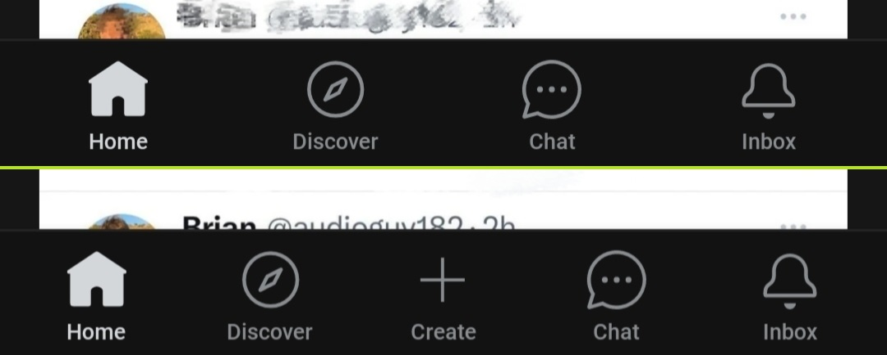
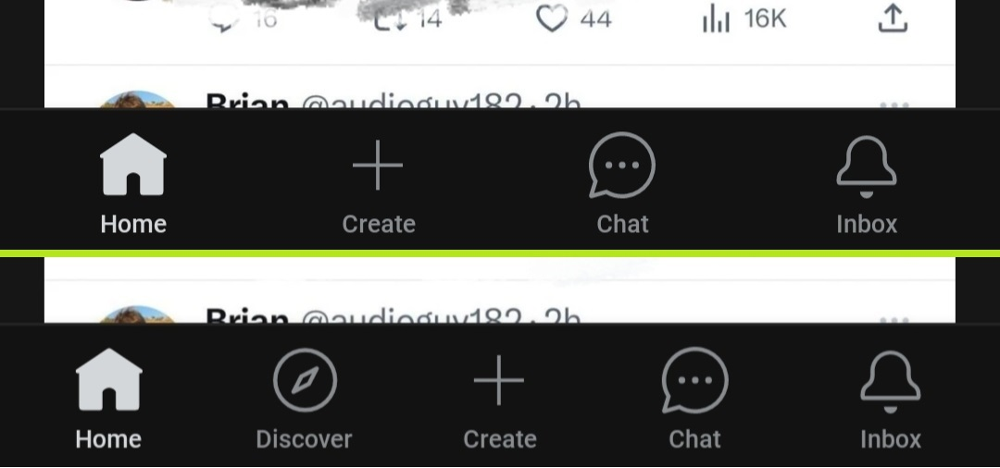

## Patches with Screenshots

#### Reddit

disable-screenshot-popup

> Disables the popup that shows up when taking a screenshot.

 

hide-ads

>Removes ads from Reddit.

 

hide-create-button

>Hide create button at navigation bar.

 

hide-discover-button

>Hides the discover button from the navigation bar.

 

open-links-directly

>Skips over redirection URLs to external links.

 &nbsp;&nbsp;&nbsp;&nbsp; 

Enabled &nbsp; &nbsp;  &nbsp; &nbsp;  &nbsp; &nbsp;  &nbsp; &nbsp;  &nbsp; &nbsp;  &nbsp; &nbsp;  &nbsp; &nbsp;  &nbsp; &nbsp;  &nbsp; &nbsp;  &nbsp; &nbsp;  &nbsp; &nbsp;  &nbsp;&nbsp;Disabled

