# Patches Documentation
<details><summary>

## Recommended Versions
</summary>

***Recommended application versions to patch for best compatibilty with patches.***

<details open><summary>

#### YouTube
</summary>

```
18.31.40, 18.30.37, 18.29.38, 18.27.36, 18.25.40, 18.24.37, 18.23.36, 18.22.37, 18.21.35, 18.20.39, 18.19.36
```

</details>

<details open><summary>
  
#### YouTube Music
</summary>

```
6.19.51, 6.15.52
```

</details>

<details open><summary>

#### Reddit
</summary>

```
all
```
</details></details>

<details><summary>

## Patches with Screenshots
</summary>

***List of patches with screenshots.***

<details><summary>

#### YouTube</summary>
include patches here

</details>

<details><summary>

#### YouTube Music</summary>
include patches here

</details>

<details><summary>

#### Reddit</summary>

<details><summary>Disable screenshot popup

>Disables the popup that shows up when taking a screenshot.
</summary>
<p>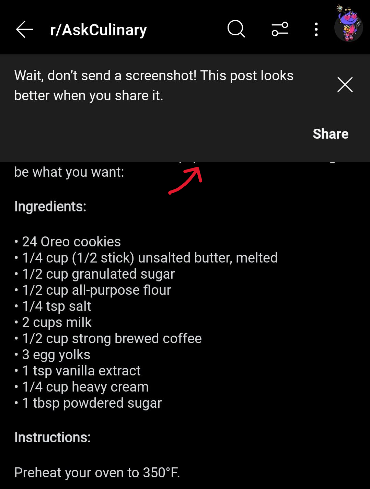</p>
</details>

<details><summary>Hide ads

>Removes ads from Reddit.
</summary>
<p>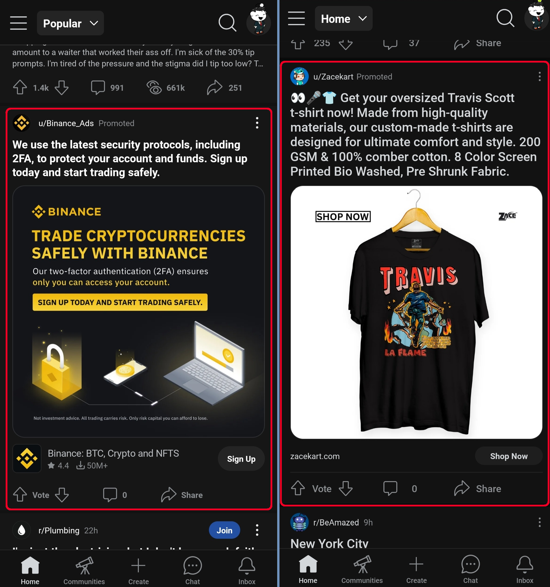</p>
</details>

<details><summary>Hide navigation buttons

>Hide buttons at navigation bar.
</summary>
<p>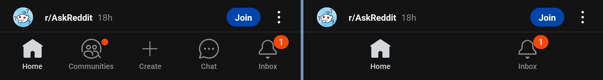</p>
</details>

<details><summary> Hide place button

>Hide r/place button in toolbar.
</summary>
<p>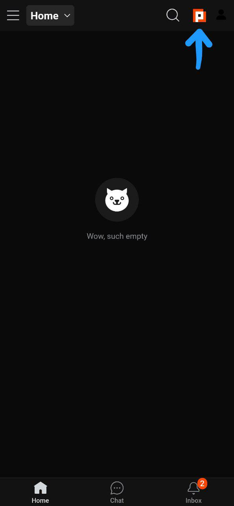</p>
</details>

<details><summary>Open links directly

>Skips over redirection URLs to external links.
</summary>
Enabled &nbsp; &nbsp; &nbsp; &nbsp; &nbsp; &nbsp; &nbsp; &nbsp; &nbsp; &nbsp; &nbsp; &nbsp; &nbsp; &nbsp; &nbsp; &nbsp; &nbsp; &nbsp; &nbsp; &nbsp; &nbsp; &nbsp; &nbsp; &nbsp; &nbsp; &nbsp; &nbsp; &nbsp; &nbsp; &nbsp; &nbsp; &nbsp; &nbsp; &nbsp; &nbsp;&nbsp; Disabled</br>
<p>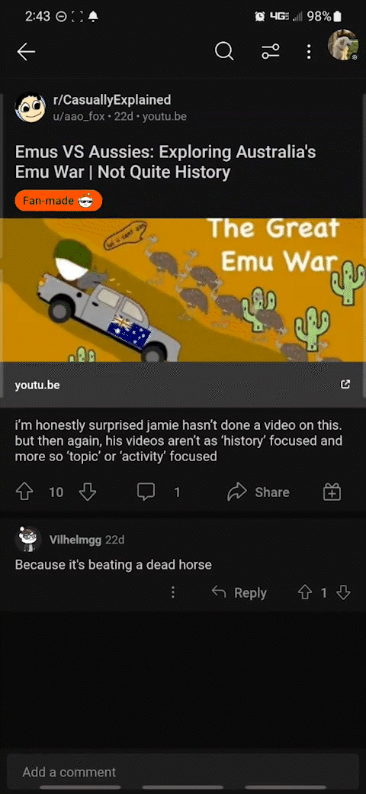 &nbsp;&nbsp;&nbsp;&nbsp;
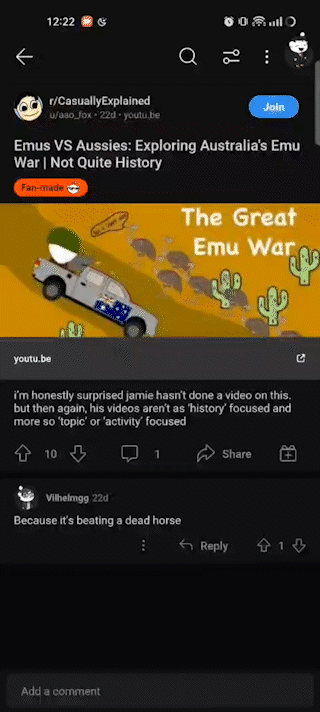</p>
</details>

<details><summary>Open links externally

>Open links outside of the app directly in your browser.
</summary>
Externally &nbsp; &nbsp; &nbsp; &nbsp; &nbsp; &nbsp; &nbsp; &nbsp; &nbsp; &nbsp; &nbsp; &nbsp; &nbsp; &nbsp; &nbsp; &nbsp; &nbsp; &nbsp; &nbsp; &nbsp; &nbsp; &nbsp; &nbsp; &nbsp; &nbsp; &nbsp; &nbsp; &nbsp; &nbsp; &nbsp; &nbsp; &nbsp; &nbsp;&nbsp; Internally</br>
<p>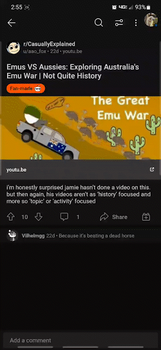&nbsp;&nbsp;&nbsp;&nbsp;
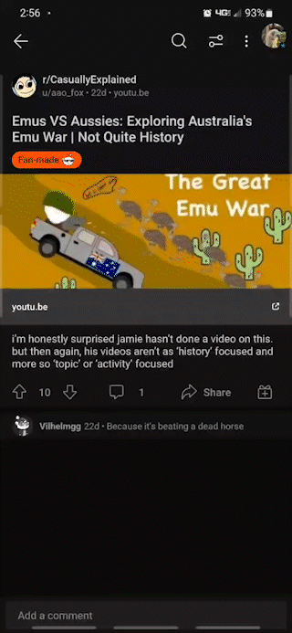</p>
</details>

<details><summary>Premium icon

>Unlocks premium icons.
</summary>
<p>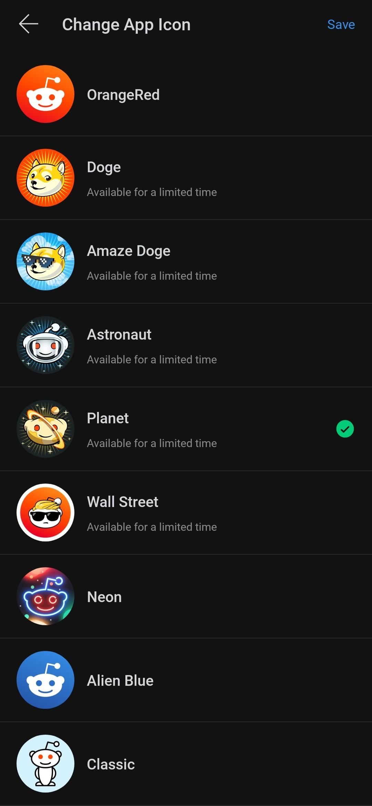</p>
</details>

<details><summary>Reddit settings

>Adds ReVanced settings to Reddit.
</summary>
<p>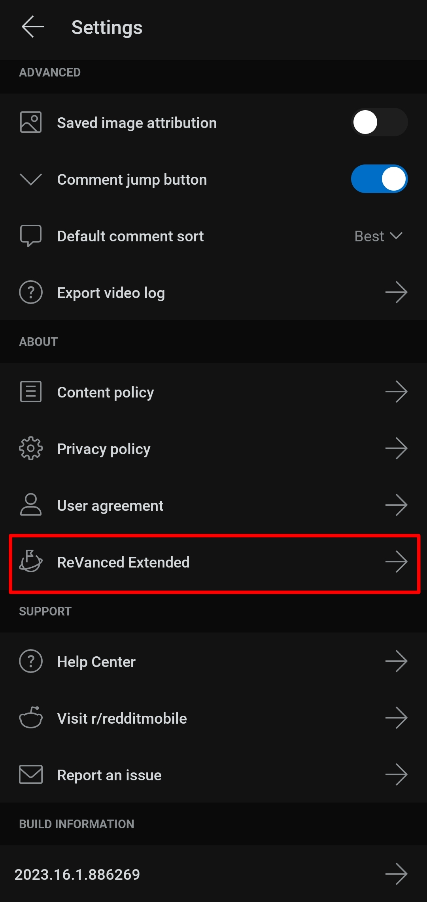</p>
</details>

<details><summary>Sanitize sharing links

> Removes (tracking) query parameters from the URLs when sharing links.
</summary>
Sanitized:</br>
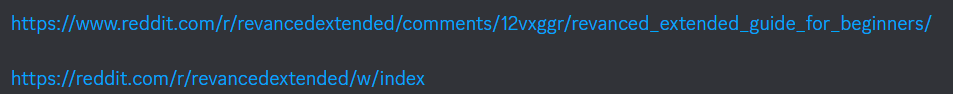</br>
Unsanitized:</br>
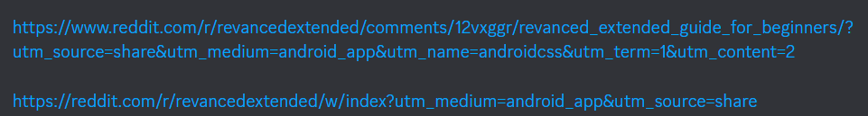
</details>

